# Link-State-Routing-Protocol

### Overall Design

**To give a detailed description of our implementation in programming assignment 1, we would like to explain the high-level design first, then elaborate on our implementation choice for each command and give a toy example last.**

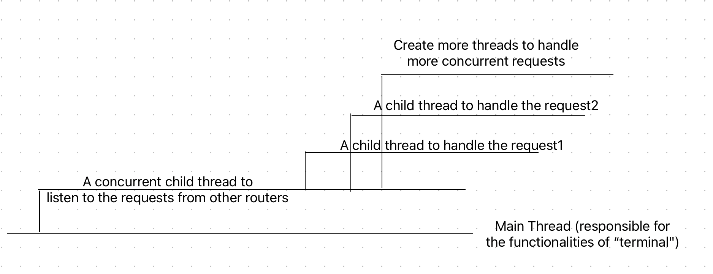

In our implementation, each Router process has several threads to handle concurrent requests from other routers. The main thread(the command line terminal) is responsible for handling different functionalities, such as attach, start, and neighbors for the router. On top of the main thread, there is a concurrent child thread to listen to the requests from other routers, and each time it hears from another router, a child thread is created to handle that request, as shown in the picture above.

### Install Requirements

#### Java Version

1. Go to [Java](https://www.oracle.com/ca-en/java/technologies/downloads/) to download the specified version below

```bash
>> java -version
java version "1.8.0_361"
Java(TM) SE Runtime Environment (build 1.8.0_361-b09)
Java HotSpot(TM) 64-Bit Server VM (build 25.361-b09, mixed mode)
```

#### Maven Version

1. Go to [Maven](https://maven.apache.org/download.cgi) to download the specified version below.

2. Set the environment variables

```bash
>> export M2_HOME="/Users/stevenyuan/apache-maven-3.8.7"
>> PATH="${M2_HOME}/bin:${PATH}"
>> export PATH
```

```bash
>> mvn -version
Apache Maven 3.8.7 (b89d5959fcde851dcb1c8946a785a163f14e1e29)
Maven home: /Users/stevenyuan/apache-maven-3.8.7
Java version: 1.8.0_361, vendor: Oracle Corporation, runtime: /Library/Java/JavaVirtualMachines/jdk1.8.0_361.jdk/Contents/Home/jre
Default locale: en_CA, platform encoding: UTF-8
OS name: "mac os x", version: "13.2.1", arch: "x86_64", family: "mac"
```

#### Compile the project

```bash
>> mvn compile
[INFO] Scanning for projects...
[INFO]
[INFO] --------------------------< groupId:COMP535 >---------------------------
[INFO] Building COMP535 1.0-SNAPSHOT
[INFO] --------------------------------[ jar ]---------------------------------
[INFO]
[INFO] --- maven-resources-plugin:2.6:resources (default-resources) @ COMP535 ---
[WARNING] Using platform encoding (UTF-8 actually) to copy filtered resources, i.e. build is platform dependent!
[INFO] Copying 0 resource
[INFO]
[INFO] --- maven-compiler-plugin:3.1:compile (default-compile) @ COMP535 ---
[INFO] Changes detected - recompiling the module!
[WARNING] File encoding has not been set, using platform encoding UTF-8, i.e. build is platform dependent!
[INFO] Compiling 11 source files to /Users/stevenyuan/Library/CloudStorage/OneDrive-McGillUniversity/phd-1/COMP535/Link-State-Routing-Protocol/target/classes
[INFO] ------------------------------------------------------------------------
[INFO] BUILD SUCCESS
[INFO] ------------------------------------------------------------------------
[INFO] Total time:  1.500 s
[INFO] Finished at: 2023-03-05T21:04:53-05:00
[INFO] ------------------------------------------------------------------------
```

```bash
>> mvn compile assembly:single
[INFO] Scanning for projects...
[INFO]
[INFO] --------------------------< groupId:COMP535 >---------------------------
[INFO] Building COMP535 1.0-SNAPSHOT
[INFO] --------------------------------[ jar ]---------------------------------
[INFO]
[INFO] --- maven-resources-plugin:2.6:resources (default-resources) @ COMP535 ---
[WARNING] Using platform encoding (UTF-8 actually) to copy filtered resources, i.e. build is platform dependent!
[INFO] Copying 0 resource
[INFO]
[INFO] --- maven-compiler-plugin:3.1:compile (default-compile) @ COMP535 ---
[INFO] Changes detected - recompiling the module!
[WARNING] File encoding has not been set, using platform encoding UTF-8, i.e. build is platform dependent!
[INFO] Compiling 11 source files to /Users/stevenyuan/Library/CloudStorage/OneDrive-McGillUniversity/phd-1/COMP535/Link-State-Routing-Protocol/target/classes
[INFO]
[INFO] --- maven-assembly-plugin:2.2-beta-5:single (default-cli) @ COMP535 ---
[INFO] META-INF/MANIFEST.MF already added, skipping
[INFO] META-INF/ already added, skipping
[INFO] META-INF/MANIFEST.MF already added, skipping
[INFO] org/ already added, skipping
[INFO] LICENSE.txt already added, skipping
[INFO] META-INF/ already added, skipping
[INFO] META-INF/MANIFEST.MF already added, skipping
[INFO] org/ already added, skipping
[INFO] META-INF/ already added, skipping
[INFO] META-INF/MANIFEST.MF already added, skipping
[INFO] ch/ already added, skipping
[INFO] ch/qos/ already added, skipping
[INFO] ch/qos/logback/ already added, skipping
[INFO] META-INF/maven/ already added, skipping
[INFO] META-INF/maven/ch.qos.logback/ already added, skipping
[INFO] META-INF/ already added, skipping
[INFO] META-INF/MANIFEST.MF already added, skipping
[INFO] org/ already added, skipping
[INFO] org/slf4j/ already added, skipping
[INFO] META-INF/maven/ already added, skipping
[INFO] Building jar: /Users/stevenyuan/Library/CloudStorage/OneDrive-McGillUniversity/phd-1/COMP535/Link-State-Routing-Protocol/target/COMP535-1.0-SNAPSHOT-jar-with-dependencies.jar
[INFO] META-INF/MANIFEST.MF already added, skipping
[INFO] META-INF/ already added, skipping
[INFO] META-INF/MANIFEST.MF already added, skipping
[INFO] org/ already added, skipping
[INFO] LICENSE.txt already added, skipping
[INFO] META-INF/ already added, skipping
[INFO] META-INF/MANIFEST.MF already added, skipping
[INFO] org/ already added, skipping
[INFO] META-INF/ already added, skipping
[INFO] META-INF/MANIFEST.MF already added, skipping
[INFO] ch/ already added, skipping
[INFO] ch/qos/ already added, skipping
[INFO] ch/qos/logback/ already added, skipping
[INFO] META-INF/maven/ already added, skipping
[INFO] META-INF/maven/ch.qos.logback/ already added, skipping
[INFO] META-INF/ already added, skipping
[INFO] META-INF/MANIFEST.MF already added, skipping
[INFO] org/ already added, skipping
[INFO] org/slf4j/ already added, skipping
[INFO] META-INF/maven/ already added, skipping
[INFO] ------------------------------------------------------------------------
[INFO] BUILD SUCCESS
[INFO] ------------------------------------------------------------------------
[INFO] Total time:  2.672 s
[INFO] Finished at: 2023-03-05T21:09:22-05:00
[INFO] ------------------------------------------------------------------------
```


#### Run a router

Change the configuration file to the one you want to run

```bash
>> java -cp target/COMP535-1.0-SNAPSHOT-jar-with-dependencies.jar socs.network.Main conf/router1.conf
```


## Milestone 1

### Implementation Choice for Each Command

#### *attach*

**Accept/Reject**: In our implementation, the main thread will be used to read the input from the user (i.e., Y/N) and then pass the input to the child thread (namely the one responsible for listening) through a `volatile` variable. 

```java
else if (command.equals("Y")) {
  signal = 1;
} else if (command.equals("N")) {
  signal = 0;
} 
```

**Automatic rejection**: Even though we enable the routers to accept/decline an `attach` request based on the terminal input `(Y/N)`, an `attach` request will be automatically rejected if the receiver router has no port available.

```java
// Find the first available port
int available_port = -1;
for(int i = 0; i < 4; i ++){
    if (router.ports[i] == null){
        available_port = i;
        break;
    }
}
// reject the attach request if there's no more ports available
if (available_port == -1){
    outputStream.writeObject("0");
    System.out.println("The attach request is automatically rejected since no more port is available;");
    System.out.print(">> ");
}
```

**Forward port number and weight**: In `processAttach`, we forward the `simulatedIP`, `processPortNumber`, and `weight` to the receiver router so that the receiver router can set up the link correspondingly.

```java
// Setup the socket used for communication and corresponding input and output
Socket clientSocket = new Socket(processIP, processPort);
ObjectOutputStream outputStream = new ObjectOutputStream(clientSocket.getOutputStream());
ObjectInputStream inputStream = new ObjectInputStream(clientSocket.getInputStream());

// Forward some information for the router to be attached
outputStream.writeObject(this.rd.simulatedIPAddress);
// Also forward the port number since the server will add corresponding link to its ports array
outputStream.writeObject(this.rd.processPortNumber);
// Also forward the weight of the link
outputStream.writeObject(weight);
```

**Add weight to link**: In addition to the given template, we added an attribute in `Link` class to denote the weight for each link.

```java
public class Link {

  RouterDescription router1;
  RouterDescription router2;
  short weight;

  public Link(RouterDescription r1, RouterDescription r2, short inWeight) {
    router1 = r1;
    router2 = r2;
    weight = inWeight;
  }
}
```

#### *start*

There is no special implementation choice for `start`. (Simply follow the instruction in the assignment's description)

#### *neighbors*

There is no special implementation choice for `neighbors`.

### *A Toy Example*

The toy example in the following shows how three routers are connected to each other. Firstly, we start the process with each router, and then we use the command "attach" to attach router 2 to router 1.  After router 1 accepts the attached request from router 2, router 2 shows that the attach is successful, and then we use the start command to make them actually connected. After both states of router 1 and router 2 become TWO_WAY,  they appear in each other's neighbours, as shown in the picture. After testing the connection of 2 routers, we also add a third router to check multiple connections, so we make router 3 attach to router 1 using the "attach" and "start" commands. After that, we can see that now router 1 has two neighbours who are router 3 and router 2, while router 3 has neighbour 1 and router 2 has neighbour 1 as well.

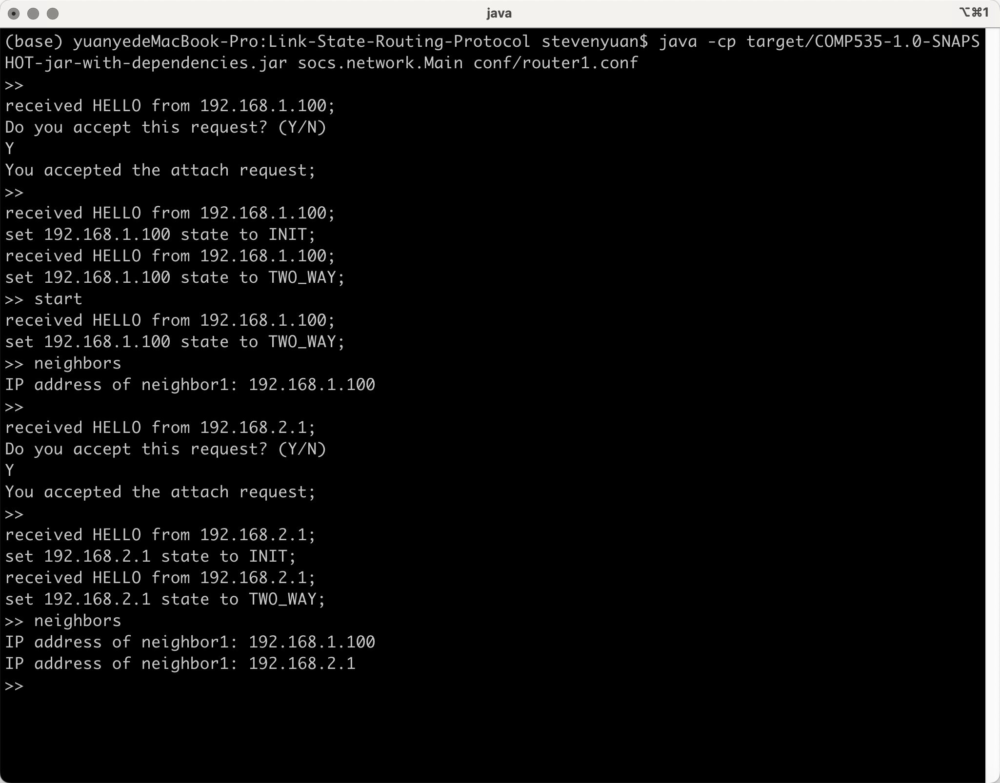

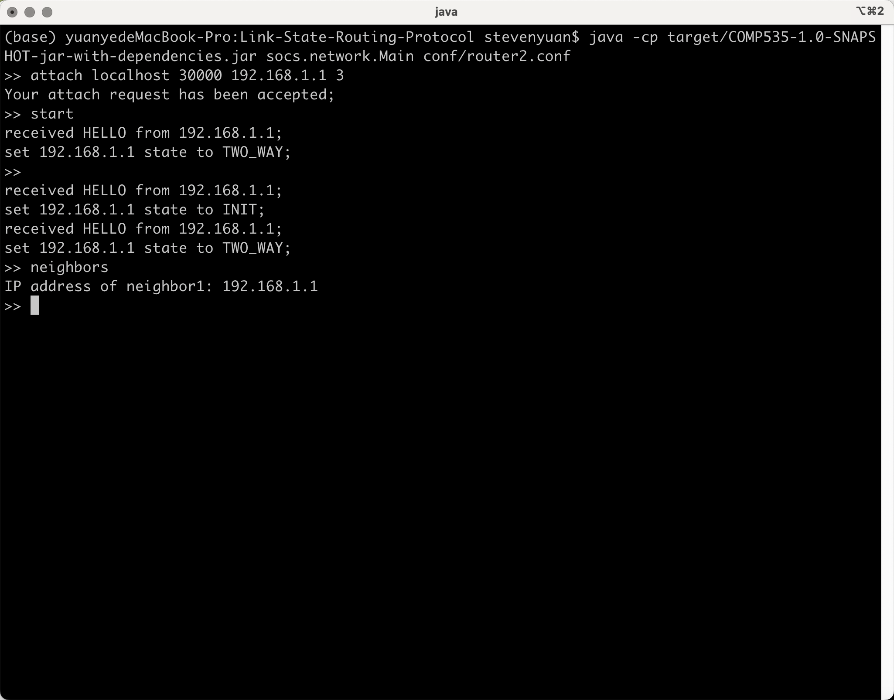

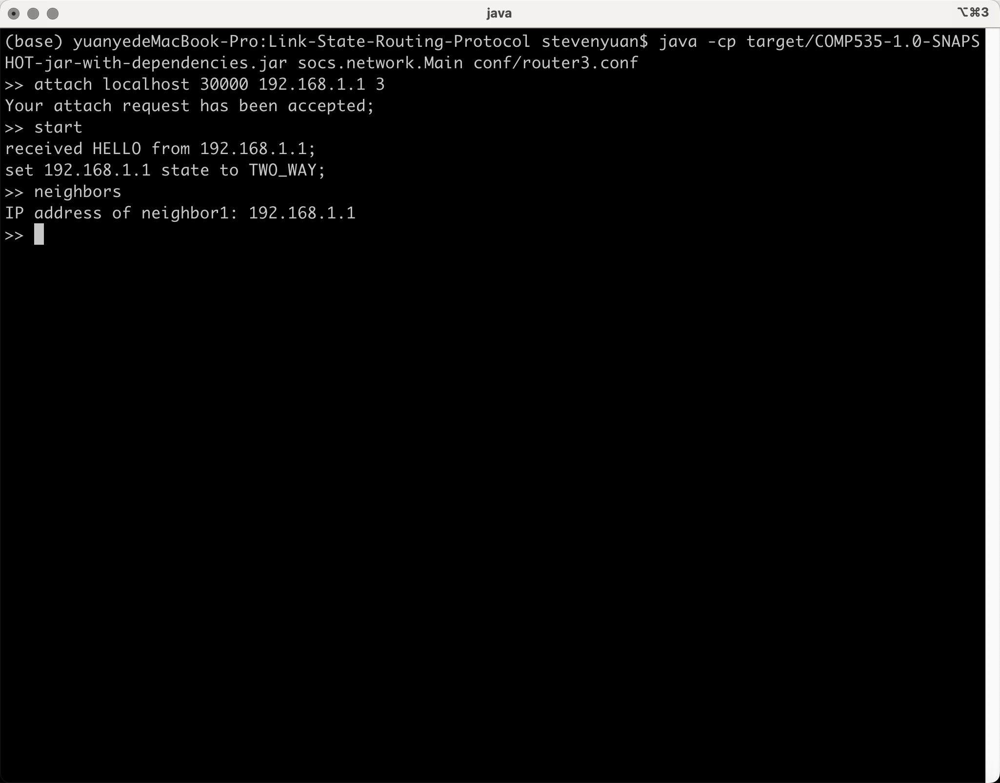


## Milestone 2

### Implementation Choice for Each Command

#### *detect*

We implemented Dijkstra's algorithm to calculate the most efficient path (i.e., the path with the smallest sum of weights). The details of Dijkstra's algorithm goes below.

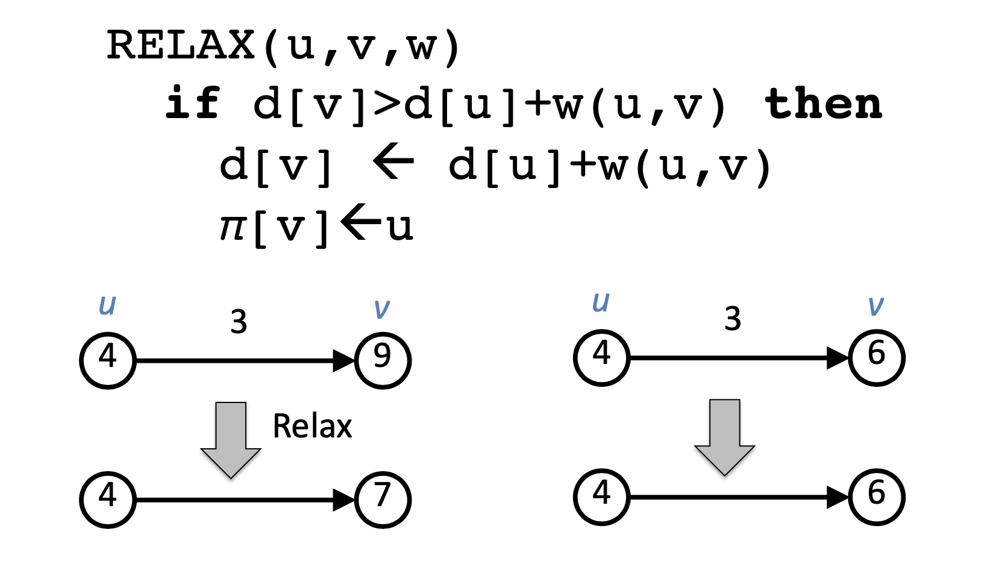

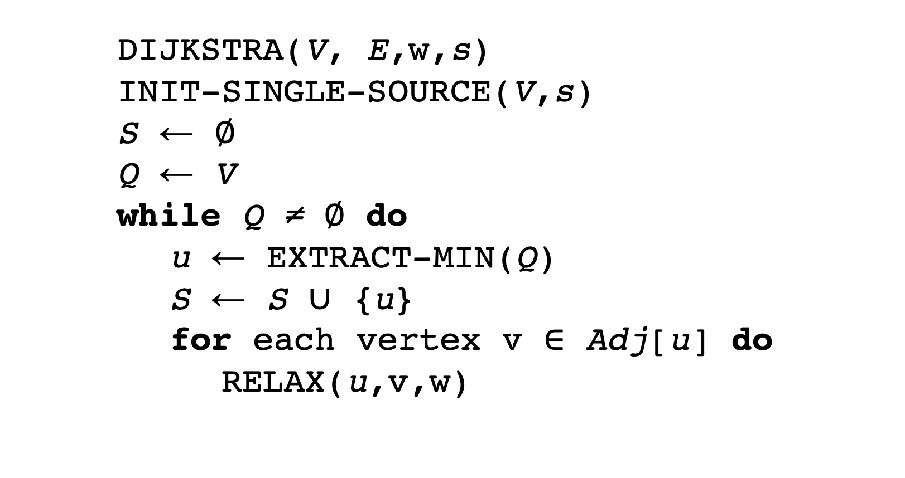

### *A Toy Example*

We used a toy example to test our implementation. We first attach router1 to router2 and router3 with weights 2 and 10, respectively. Then we attach router2 to router3 with weight 3 and run the `start` command for each router. After setting up the whole topology, we detect the most efficient path for different cases.

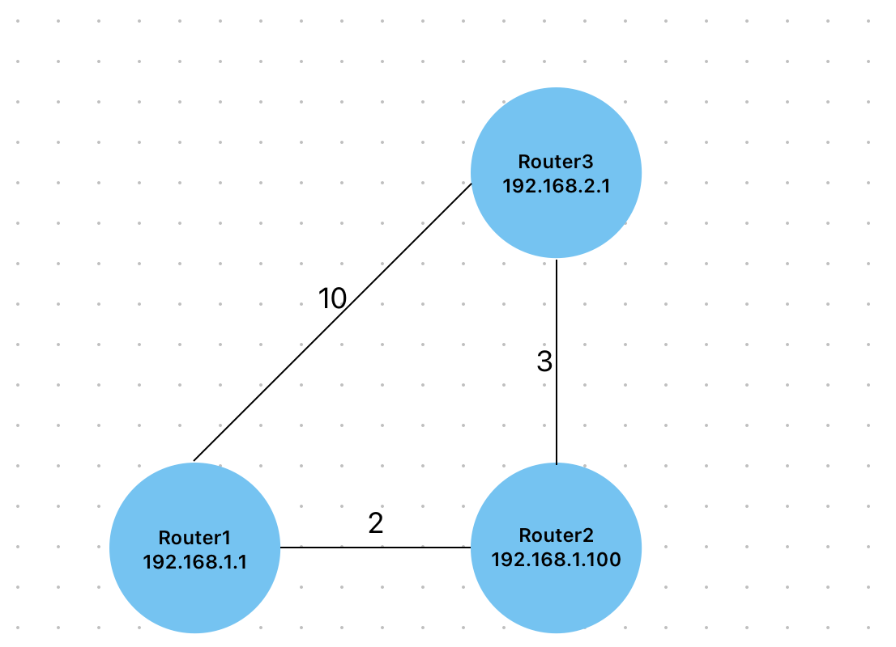

#### Router1

```bash
>> java -cp target/COMP535-1.0-SNAPSHOT-jar-with-dependencies.jar socs.network.Main conf/router1.conf
>> attach localhost 30001 192.168.1.100 2
>> attach localhost 30002 192.168.2.1 10
>> start
>> detect 192.168.2.1
```

#### Router2

```bash
>> java -cp target/COMP535-1.0-SNAPSHOT-jar-with-dependencies.jar socs.network.Main conf/router2.conf
>> attach localhost 30002 192.168.2.1 3
>> start
>> detect 192.168.2.1
>> detect 192.168.1.1
```

#### Router3

```bash
>> java -cp target/COMP535-1.0-SNAPSHOT-jar-with-dependencies.jar socs.network.Main conf/router3.conf
>> start
>> detect 192.168.1.1
```

**The running results of the above toy example are shown below.**

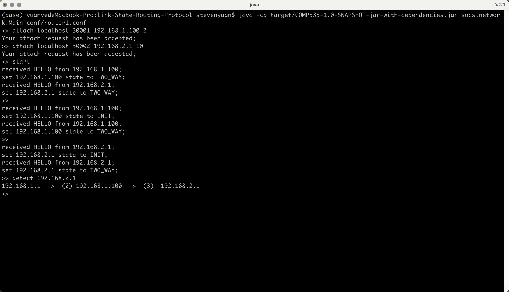

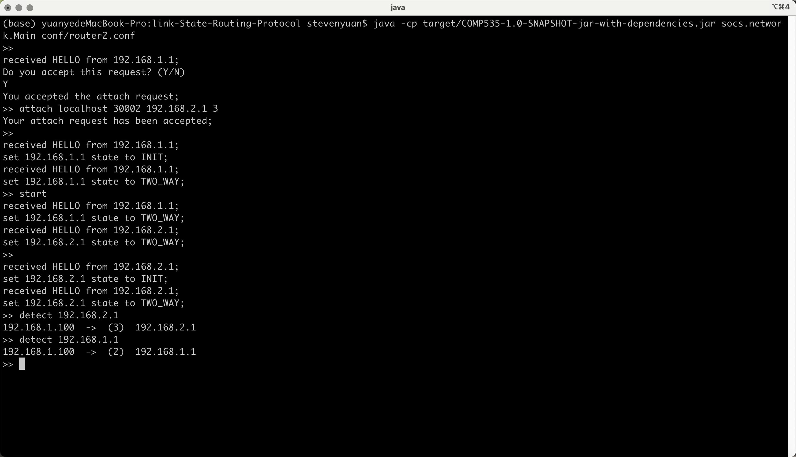

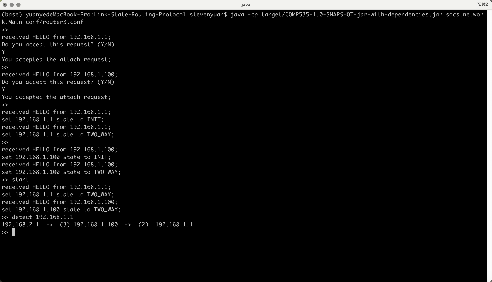


## Milestone 3

### Implementation Choice

#### *connect*

Similar to the `attach`, the router to be connected can also manually input `Y/N` to accept or reject the `connect` request. Moreover, a  `connect` request will be automatically rejected if there's no port available.

#### *disconnect*

To use the disconnect command, the users are expected to input a port number. The router connected in this port will be disconnected from the current router. Whereas, since the port numbers are dynamically allocated during the attach or connect process, users are unable to know in which porter a given router is. Therefore, we design a new command `portInfo` by ourselves. This command will demonstrate the information of the routers connected in all ports.

```bash
>> portInfo
The Router Connected in Port 0 is: 192.168.1.1
The Router Connected in Port 1 is: None
The Router Connected in Port 2 is: None
The Router Connected in Port 3 is: None
```

#### *quit*

We first check if there're any connected routers for this router. If not, we can quit directly. Otherwise, we should disconnect the current router to all of its connected routers and quit then.


### *Toy Examples*

We will use three examples here to demonstrate the new functionalities in Milestone3.

#### *Ex1*

##### Router1

```bash
>> java -cp target/COMP535-1.0-SNAPSHOT-jar-with-dependencies.jar socs.network.Main conf/router1.conf
>> start
>> connect localhost 30001 192.168.1.100 2
>> detect 192.168.1.100
>> portInfo
>> disconnect 0
>> portInfo
>> detect 192.168.1.100
>> quit
```

##### Router2

```bash
>> java -cp target/COMP535-1.0-SNAPSHOT-jar-with-dependencies.jar socs.network.Main conf/router2.conf
>> start
>> detect 192.168.1.1
>> portInfo
>> portInfo
>> detect 192.168.1.1
>> quit
```

**The running results of the above toy example are shown below.**

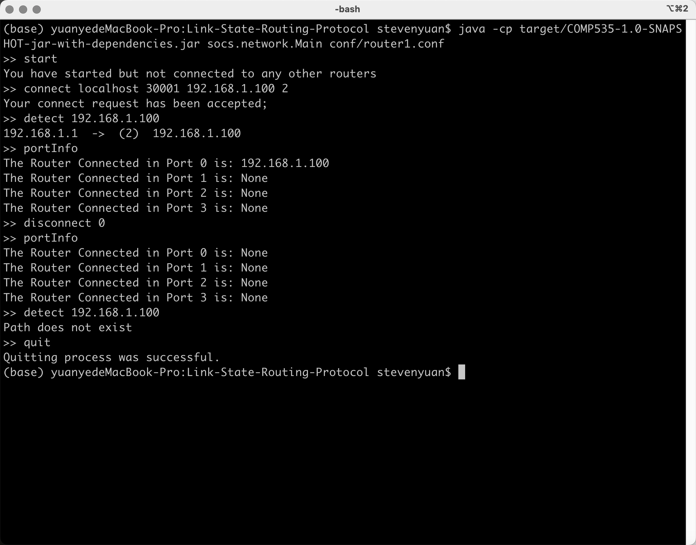

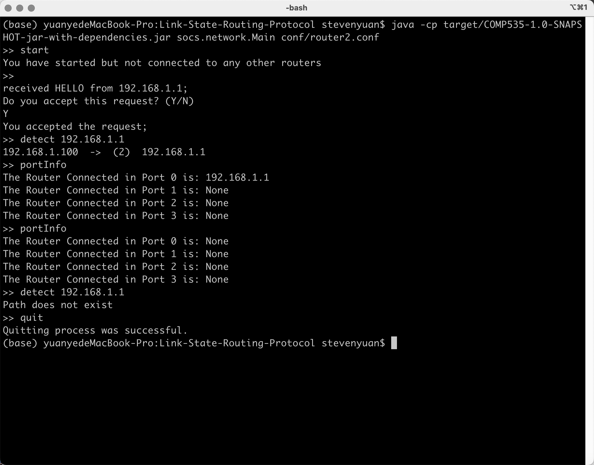


TODO: (Assigned to Winston)

1. Add examples with 4 and 6 routers, respectively.

2. Include a figure to illustrate the toy example (Use Apple Freeform to draw).

3. Add code block to demonstrate how to set up the toy example.

   Add the code blocks below

   hiiiiii

**The running results of the above toy example are shown below.**
